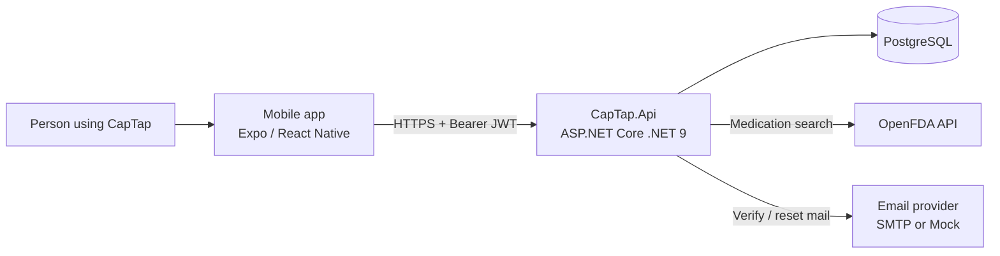
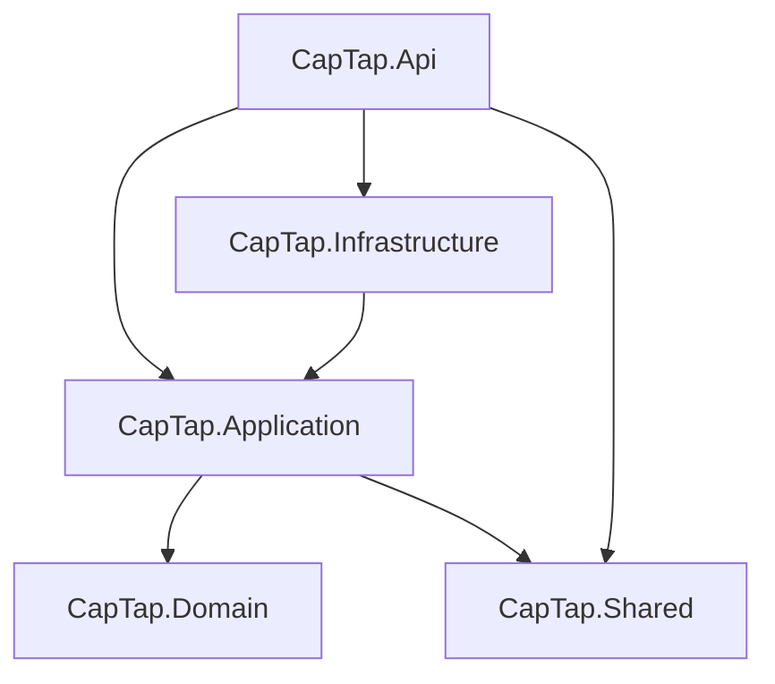

# CapTap system context

High-level view of how CapTap components relate and where trust boundaries sit.

## Context diagram

## Containers (logical)

| Container | Responsibility |
|-----------|----------------|
| **Mobile app** | UI, SecureStore for tokens, SQLite offline queue + cache, local reminders / quiet hours, NFC assign & confirm |
| **CapTap.Api** | Auth, medications, schedules, adherence, dose logs, NFC resolve, account soft-delete |
| **PostgreSQL** | Source of truth for users, meds, schedules, logs, NFC mappings, hashed tokens, audit events |
| **OpenFDA** | Lookup-only medication search; CapTap is not a clinical authority |
| **Email** | Verification and password-reset delivery (`Mock` in local Dev, `Smtp` in Production) |

## Backend layering

Dependency rule: references point **inward**. Domain has no outer-layer packages. Application never references Infrastructure (ports only).

## Trust boundaries

1. **Untrusted** — mobile client, public network, any client-supplied ids in bodies.
2. **API edge** — TLS (production), JWT validation, rate limiting, FluentValidation, ownership checks via `CurrentUserId` from claims.
3. **Trusted data plane** — API process + PostgreSQL (private network in cloud deployments).
4. **Secrets** — local `.env` (gitignored); production secret store (documented for AWS; Azure Key Vault when deployed). Never commit JWT secrets, DB passwords, or SMTP credentials.

## Related docs

- [Sequence diagrams](sequences.md)
- [Threat model](../security/threat-model.md)
- [ADRs](../adr/README.md)
- [Database design](../database-design.md)
- [Authentication](../authentication.md)
- [Offline architecture](../offline-architecture.md)
