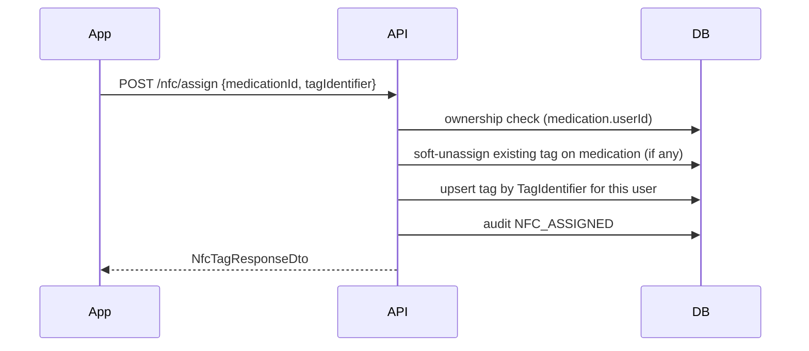
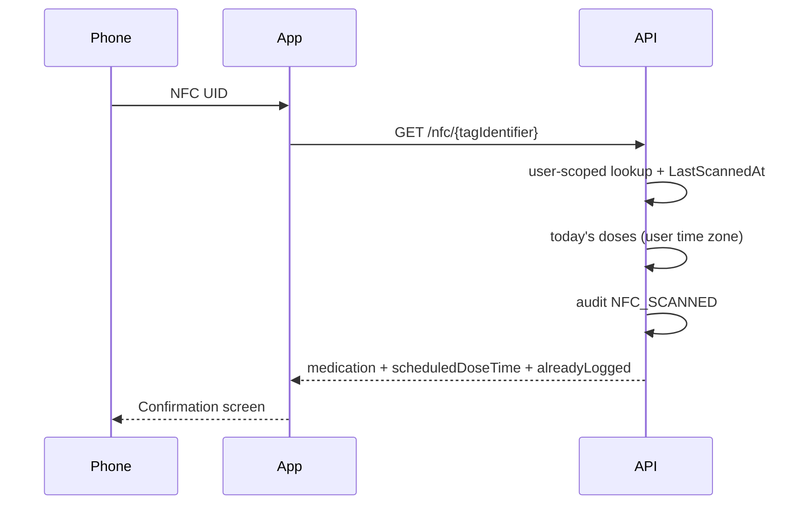
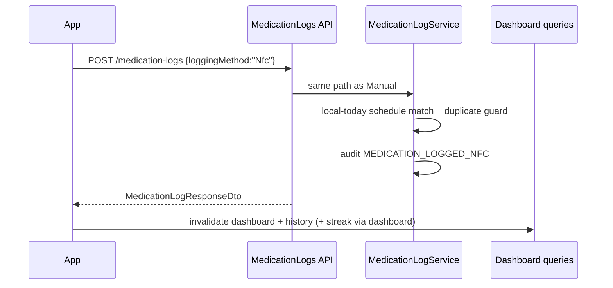

# CapTap NFC Integration

Phase 9 adds NFC as a **convenience path** into the existing medication logging pipeline. Scanning a bottle never invents a second logging system.

## Architecture

```
Physical NFC sticker (opaque TagIdentifier only)
        ↓
POST /api/v1/nfc/assign  (one-time pairing)
        ↓
NfcTags row (UserId + MedicationId + IsAssigned)
        ↓
Scan → GET /api/v1/nfc/{tagIdentifier}
        ↓
Resolve medication + today's local schedule
        ↓
Confirmation UI (explicit Confirm)
        ↓
POST /api/v1/medication-logs  (LoggingMethod = Nfc)
        ↓
Same MedicationLogService / streaks / dashboard as Manual
```

### Domain (`NfcTag`)

| Field | Meaning |
|-------|---------|
| `UserId` | Owner (never resolve other users' tags) |
| `MedicationId` | Linked medication |
| `TagIdentifier` | Hardware UID (normalized uppercase) |
| `IsAssigned` | Soft assignment flag — rows are never hard-deleted |
| `AssignedAt` / `LastScannedAt` | UTC timestamps |

Rules:

- One physical sticker identity (`TagIdentifier` unique forever).
- At most one **assigned** sticker per medication (filtered unique index).
- Reassignment soft-unassigns the previous medication link, then updates the tag row.
- Tags store **no medication names** — only opaque identifiers.

## Assignment workflow



Unassign: `POST /api/v1/nfc/unassign` sets `IsAssigned = false` (row kept) and audits `NFC_UNASSIGNED`.

## Scanning a bottle



Security:

- Unknown tags and other users' tags both return identical **404** ("NFC tag was not found").
- Resolution never returns medications the caller does not own.

## Logging a medication (shared pipeline)



Manual uses `LoggingMethod = Manual` / audit `MEDICATION_LOGGED`.  
NFC uses `LoggingMethod = Nfc` / audit `MEDICATION_LOGGED_NFC`.  
**There is no dedicated NFC logging endpoint.**

## Dashboard refresh

After confirm, mobile `useLogMedication` invalidates:

- `queryKeys.dashboard` (today + streak stats)
- `queryKeys.logHistory`

Optimistic Taken updates match Manual.

## Time zone handling

### Assumptions

1. All persisted timestamps (`LoggedAt`, `ScheduledDoseTime`, `AssignedAt`, …) are **UTC**.
2. Schedule `TimeOnly` values are **wall-clock times in the user's IANA zone** (e.g. `08:00` means 8am local).
3. `Users.TimeZoneId` stores an IANA id (`America/New_York`). Default `UTC`.
4. "Today", missed windows, and streaks use the user's **local calendar day**.
5. Mobile syncs `Intl` zone via `PUT /api/v1/users/me/timezone` after login/restore.
6. Invalid IANA ids fall back to UTC server-side.

### Conversion points

- Adherence status: local now vs schedule wall clock.
- Log "today only" rule: local date of `ScheduledDoseTime` must equal local today.
- Canonical `ScheduledDoseTime` stored = `localDate + schedule.ScheduledTime` → UTC.
- Log day queries use UTC ranges from `TimeZoneHelper.LocalDayUtcRange`.

## Local development setup

### Database

```bash
colima start   # if needed
export DOCKER_HOST=unix://${HOME}/.colima/docker.sock
docker compose up -d postgres
cd server
dotnet ef database update --project CapTap.Infrastructure --startup-project CapTap.Api
```

Migrations of note:

- `MedicationLoggingFields` — Phase 8 logging columns
- `NfcAndUserTimeZone` — `NfcTag.UserId` / `IsAssigned` / `LastScannedAt`, `Users.TimeZoneId`, `AuditLogs.Metadata`

Verify tables: `NfcTags`, `MedicationLogs`, `Users.TimeZoneId`.

### Mobile environment (never hardcode LAN IPs in source)

| Context | `EXPO_PUBLIC_API_URL` |
|---------|----------------------|
| iOS Simulator / Android Emulator (host loopback) | `http://localhost:5001` (Android emulator often `http://10.0.2.2:5001`) |
| Physical device on LAN | `http://<your-LAN-IP>:5001` e.g. `http://192.168.1.25:5001` |
| Production | `https://api.your-domain.com` |

Set via `.env.development` / EAS env — **do not commit machine-specific IPs**.

### NFC hardware testing

- `react-native-nfc-manager` requires a **development build** (not Expo Go).
- Physical Android/iOS device with NFC.
- Assign from medication details → Scan bottle from dashboard → Confirm → dashboard updates.

Unsupported / Expo Go / simulator: scan screen shows a clear unsupported message; cancel works.

## Performance considerations

Current streak engine evaluates days one-by-one (up to 365). Acceptable for v1.

**Future optimization (do not premature-optimize):**

1. Bulk-load active schedules for the lookback window.
2. Bulk-load medication logs for the UTC range covering those local days.
3. Compute day completions and streaks **in memory**.

Extension point: keep `IAdherenceStreakService` as the single entry; swap internals without changing dashboard contracts.

## Audit events

| Action | When |
|--------|------|
| `NFC_ASSIGNED` | Tag linked |
| `NFC_UNASSIGNED` | Soft unassign |
| `NFC_SCANNED` | Resolve hit |
| `MEDICATION_LOGGED_NFC` | Dose logged via NFC |

Metadata JSON (when present): `{ medicationId, tagIdentifier, deviceId }`.  
IP from connection; device id from `X-Device-Id` header when provided.

## API summary

| Method | Path | Purpose |
|--------|------|---------|
| GET | `/api/v1/nfc/tags` | List assigned tags |
| POST | `/api/v1/nfc/assign` | Assign / reassign |
| POST | `/api/v1/nfc/unassign` | Soft unassign |
| GET | `/api/v1/nfc/{tagIdentifier}` | Resolve for confirm UI |
| PUT | `/api/v1/users/me/timezone` | Persist IANA zone |
| POST | `/api/v1/medication-logs` | Shared Manual/Nfc logging |
