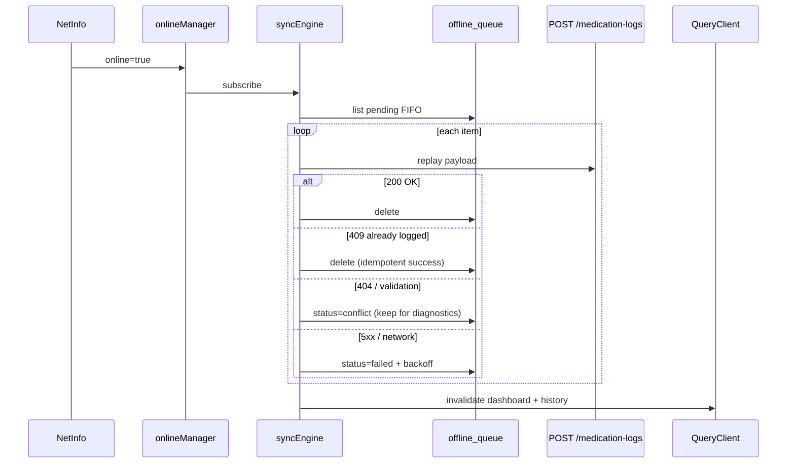
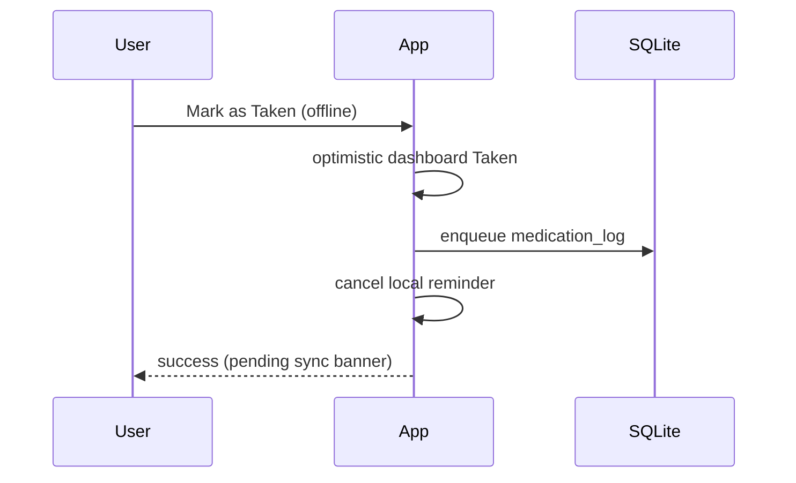
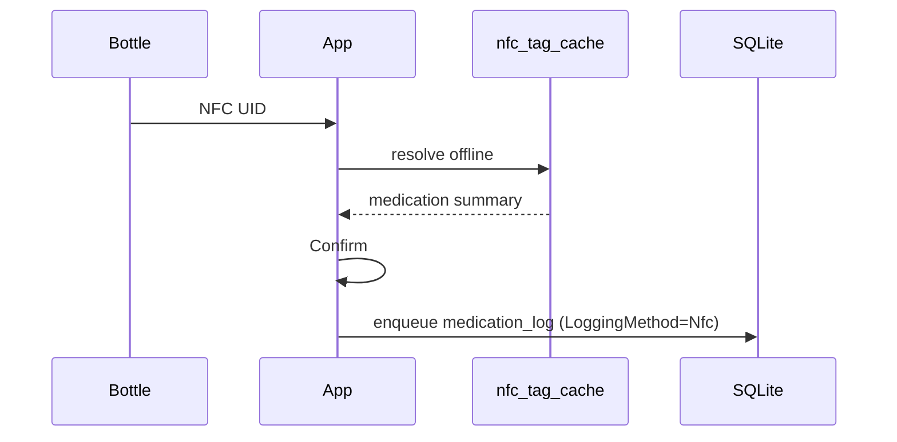
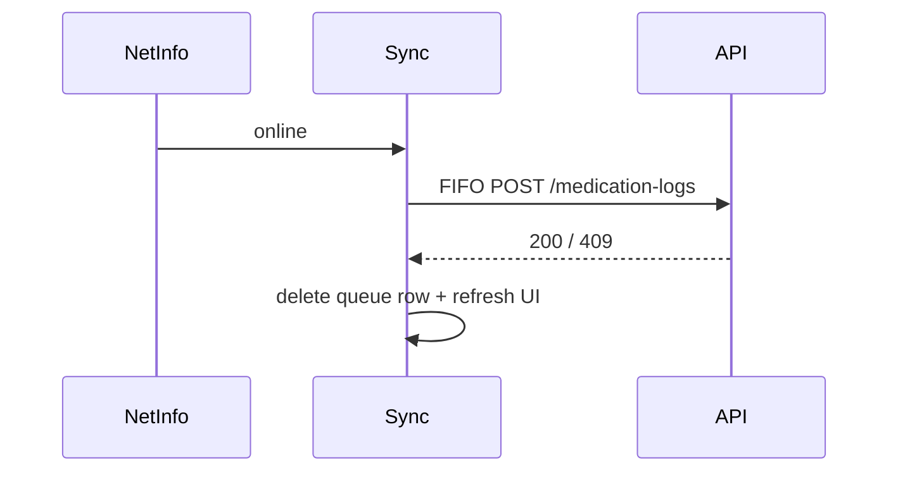
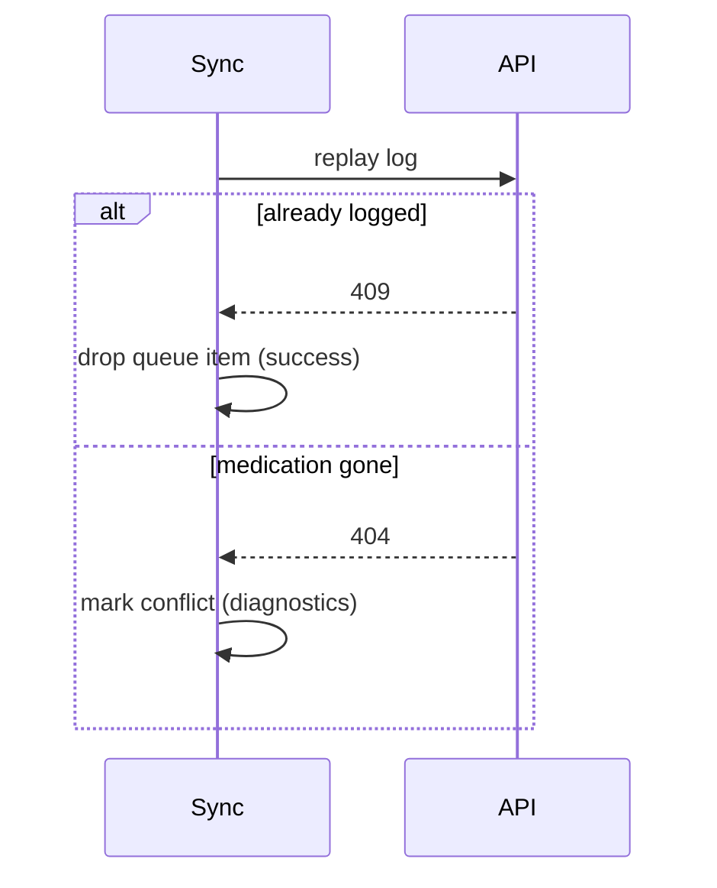

# CapTap Offline Architecture (Phase 11)

Phase 11 makes CapTap **offline-capable** for the critical path: viewing today, logging doses (Manual / NFC), and syncing automatically when connectivity returns.

SQLite is a **synchronization queue + cache**, not a second source of truth. The ASP.NET API remains authoritative after replay.

## Offline architecture overview

```
Online path (unchanged)
  UI → POST /api/v1/medication-logs → MedicationLogService → DB

Offline path
  UI → optimistic dashboard/history update
     → enqueue payload in SQLite offline_queue
     → cancel local reminder
     → banner: "saved offline"

Reconnect
  NetInfo → onlineManager online
         → processOfflineQueue (FIFO)
         → POST /medication-logs
         → remove queue row on success / idempotent 409
         → invalidate dashboard + history
```

NFC offline:

1. Successful online resolve / assign seeds `nfc_tag_cache`.
2. Offline scan reads cache → confirmation UI.
3. Confirm still uses the **same** log mutation (queued if offline).

## SQLite schema summary

Database file: `captap-offline.db` (expo-sqlite).

### `offline_queue`

| Column | Purpose |
|--------|---------|
| `id` | Queue row id |
| `kind` | `medication_log` (extensible) |
| `payload_json` | `CreateMedicationLogRequest` JSON |
| `client_request_id` | Idempotency / optimism key |
| `status` | `pending` / `syncing` / `failed` / `conflict` |
| `attempts` | Retry counter |
| `last_error` | Last failure message |
| `created_at` / `updated_at` | ISO timestamps |

### `query_cache`

Persisted TanStack Query dehydrations (dashboard, medications, schedules, history, NFC tags).

### `nfc_tag_cache`

| Column | Purpose |
|--------|---------|
| `tag_identifier` | Normalized UID |
| `resolve_json` | Last `NfcResolveDto` (or assign-seeded summary) |
| `updated_at` | ISO timestamp |

### `sync_meta`

Key/value (e.g. `lastSyncAt`).

## Offline queue design

- Enqueue when `onlineManager.isOnline() === false` **or** the live POST fails with network/timeout.
- UI updates immediately (optimistic Taken + history row).
- No user action required to sync.

## Synchronization lifecycle



Retry policy: exponential backoff, max 5 attempts per pass, stop pass on transient head-of-line failure (retry on next reconnect).

## Conflict resolution

| Server response | Client action |
|-----------------|---------------|
| **409 Conflict** / "already logged" | Treat as success; remove queue item (never duplicate) |
| **404** medication missing / archived | Mark `conflict`; surface recoverable guidance; do not loop forever |
| **400 validation** | Mark `conflict`; keep for diagnostics |
| **5xx / network / timeout** | Mark `failed`; retry with backoff |

Strategy summary: **server wins for duplicates**; CapTap prefers a single log over inventing a second one.

## NetInfo integration

`QueryProvider` wires:

```ts
onlineManager.setEventListener((setOnline) =>
  NetInfo.addEventListener((state) => {
    setOnline(Boolean(state.isConnected && state.isInternetReachable !== false));
  }),
);
```

- Queries use `networkMode: "offlineFirst"` (serve cache while offline).
- Log mutation uses `networkMode: "always"` with custom online/queue branching.
- Background sync pauses while offline and resumes on reconnect via `attachSyncEngine`.

## Local data strategy

Persisted via `@tanstack/react-query-persist-client` + SQLite persister:

- Today's dashboard
- Medication list / detail
- Schedules
- Recent medication history
- NFC tag list

Cache is shown immediately; online refreshes in the background.

## EAS configuration

`mobile/eas.json` profiles:

- `development` — device dev client (NFC + notifications)
- `development-simulator` — iOS simulator client
- `preview` / `production`

### Setup for new developers

```bash
npm i -g eas-cli
cd mobile
eas login
eas init          # creates projectId — paste into app.json extra.eas.projectId
npm run build:dev:ios      # or :android
# Install build on device, then:
EXPO_PUBLIC_API_URL=http://<LAN_IP>:5001 npx expo start --dev-client
```

Replace `replace-with-eas-project-id` in `app.json` after `eas init`.

**Do not rely on Expo Go** for NFC or production-like notification behavior.

## Development build / physical device checklist

See also `docs/production-validation.md`.

| Area | Offline expectation | Pass? |
|------|---------------------|-------|
| View today's meds offline | Cached dashboard | ☐ |
| Manual Mark as Taken offline | Optimistic UI + queue | ☐ |
| NFC scan offline (cached tag) | Confirm → queued log | ☐ |
| Airplane mode → reconnect | Auto sync, banner clears | ☐ |
| Duplicate log (already on server) | No second row | ☐ |
| Reminder still cancels on offline log | Local cancel | ☐ |

### Device validation status (this environment)

Automated agent environments cannot install EAS builds or exercise physical NFC/reminders. Complete the checklist on hardware before calling Phase 11 production-ready.

## Airplane-mode E2E checklist (manual)

Prerequisites: development build installed; API reachable on LAN; at least one medication + schedule; NFC tag assigned while online (to seed `nfc_tag_cache`).

| # | Action | Expected |
|---|--------|----------|
| 1 | Open dashboard online | Today doses load; reminders scheduled |
| 2 | Airplane Mode ON | Cached dashboard still visible |
| 3 | Mark as Taken (Manual) | Taken optimistic; pending banner; **local reminder for that schedule cancelled** |
| 4 | Scan cached NFC → Confirm | Confirm UI from cache; log queued; **reminder cancelled** |
| 5 | Airplane Mode OFF | NetInfo online → FIFO sync; banner clears; history/dashboard match API |
| 6 | Force re-sync / second confirm | Idempotent 409; no duplicate log |

Confirm reminders: after offline log, check scheduled notifications (or wait past fireAt) — cancelled id `captap-reminder:{scheduleId}:{YYYY-MM-DD}` must be gone.

## Performance observations

- Queue replay is O(n) pending items; keep queue small (daily doses).
- Adherence/streak remain server-side day-by-day; unchanged unless profiling shows multi-year cost.
- Future (only if needed): batched sync, bulk streak loads, incremental streak cache.

## Sequence diagrams

### Offline medication logging



### Offline NFC logging



### Queue synchronization



### Conflict resolution



## Environment configuration

| Context | `EXPO_PUBLIC_API_URL` |
|---------|----------------------|
| Simulator | `http://localhost:5001` |
| Android emulator | `http://10.0.2.2:5001` |
| Physical LAN | `http://<LAN_IP>:5001` |
| Production | `https://…` |

Never commit personal LAN IPs. Use `mobile/.env.example` / root `.env.example`.

## Related code

- `mobile/src/services/localDatabase.ts`
- `mobile/src/services/syncEngine.ts`
- `mobile/src/services/queryPersister.ts`
- `mobile/src/hooks/useMedicationLogs.ts`
- `mobile/src/context/QueryProvider.tsx`
