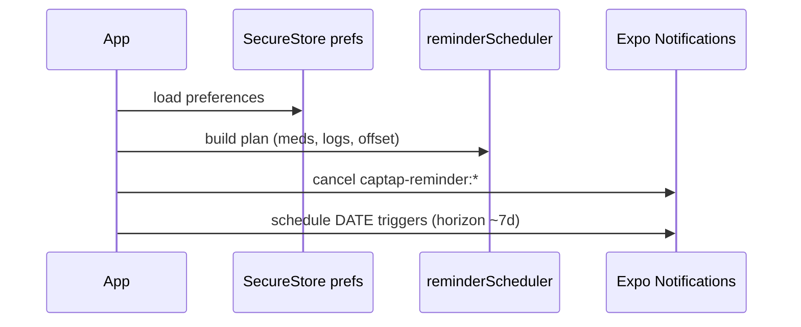
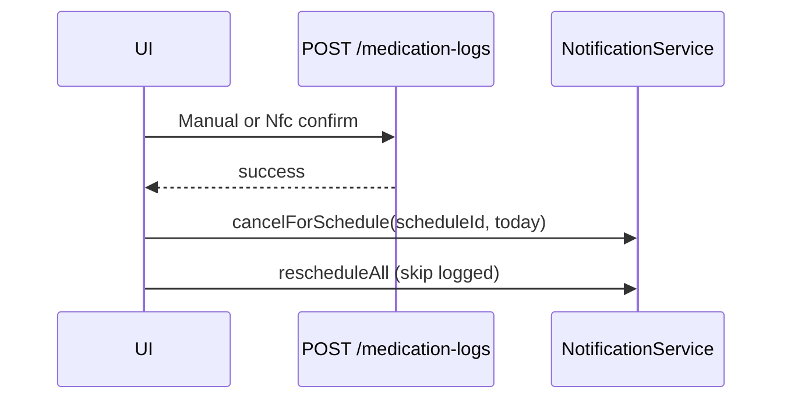
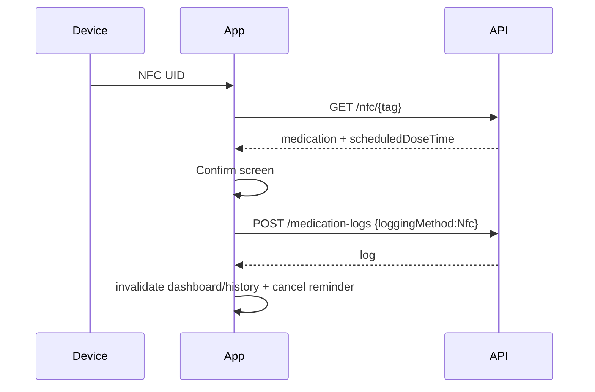
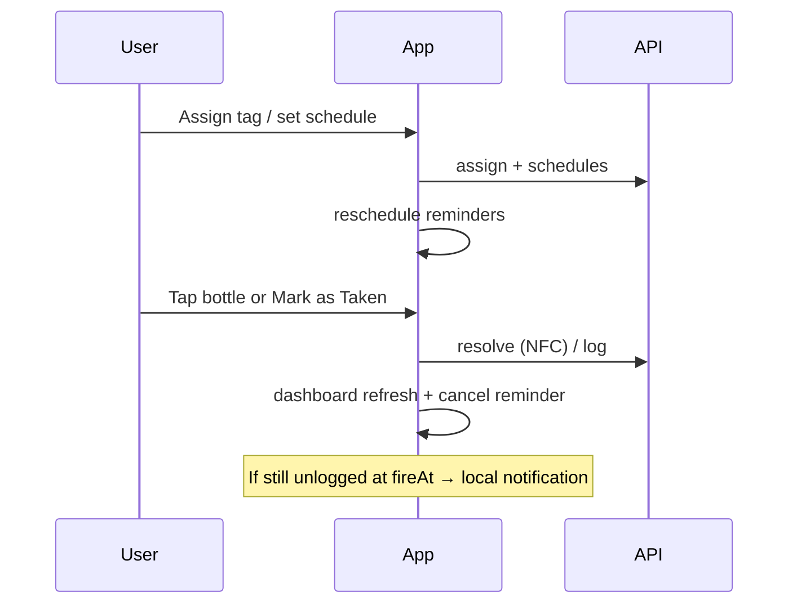

# CapTap Production Validation (Phase 10)

Phase 10 moves CapTap from a functional prototype toward reliable daily use:

- Physical NFC validation on a **development build** (not Expo Go alone)
- Local medication reminder notifications (Expo Notifications)
- Production iOS NFC configuration documented
- NetInfo wired for Phase 11 offline work (no sync queue yet)

## Physical device testing process

### Prerequisites

1. NFC-capable Android or iPhone
2. Mac on the same Wi-Fi as the phone (for LAN API access)
3. Colima/Docker Postgres + CapTap API on port `5001`
4. Expo account + EAS CLI (`npm i -g eas-cli`)

### Development build setup

Interactive (requires your Expo account — agents cannot complete `eas login` for you):

```bash
cd mobile
npx eas login
npm run eas:init
# Paste the printed projectId into app.json → expo.extra.eas.projectId
# (replace "replace-with-eas-project-id")

# Build a device client (NFC + notifications require this)
npm run build:dev:ios        # or build:dev:android
# Install the artifact on a physical device, then:
EXPO_PUBLIC_API_URL=http://<YOUR_LAN_IP>:5001 npx expo start --dev-client
```

Do **not** rely on Expo Go for NFC or reliable local notifications.

Verify login: `npm run eas:whoami`

### Environment configuration

| Context | `EXPO_PUBLIC_API_URL` |
|---------|----------------------|
| iOS Simulator | `http://localhost:5001` |
| Android Emulator | `http://10.0.2.2:5001` |
| Physical device | `http://<LAN_IP>:5001` |
| Production | `https://api.your-domain.com` |

Examples live in:

- `mobile/.env.example`
- root `.env.example`

**Never commit personal LAN IPs.** Use `.env.development.local` (gitignored) or shell exports.

If the app shows network errors on device: confirm the API binds `0.0.0.0:5001`, firewall allows LAN, and the phone is on the same network.

## NFC validation checklist

Run on a development build and record results:

| Step | Expected | Pass? | Notes |
|------|----------|-------|-------|
| Assign NFC tag from medication details | Tag UID linked; audit `NFC_ASSIGNED` | ☐ | |
| Scan bottle (Dashboard → Scan) | Resolve returns med + schedule | ☐ | |
| Confirmation screen | Name, dosage, time, status | ☐ | |
| Confirm | `POST /medication-logs` `LoggingMethod=Nfc` | ☐ | |
| Dashboard | Dose → Taken; streak/completion update | ☐ | |
| History | New NFC log appears | ☐ | |
| Unknown / other-user tag | Friendly 404 guidance | ☐ | |
| Cancel mid-scan | Returns without logging | ☐ | |
| Unsupported (simulator / Expo Go) | Clear unsupported message | ☐ | |

### Platform notes (fill during validation)

| Topic | iOS | Android |
|-------|-----|---------|
| NFC session UX | System sheet / reader session | Foreground dispatch |
| Background tag read | Limited; prefer in-app scan | Varies by OEM |
| Permission copy | `NFCReaderUsageDescription` | `NFC` permission |
| Dev build install | Ad hoc / TestFlight internal | APK / internal track |

**Agent note:** Automated CI cannot exercise physical NFC hardware. Complete the checklist on-device before treating Phase 10 as production-ready.

## Apple Developer / iOS production requirements

CapTap NFC is **not** represented by Expo Go entitlements. Production / TestFlight builds need:

1. **App ID** `com.captap.app` with **Near Field Communication Tag Reading** capability enabled in the Apple Developer portal.
2. **Provisioning profile** that includes the NFC Tag Reading entitlement.
3. **Info.plist** (via `app.json` → `ios.infoPlist`):
   - `NFCReaderUsageDescription` — user-facing purpose string
4. **Entitlements** (via `app.json` → `ios.entitlements`):
   - `com.apple.developer.nfc.readersession.formats`: `NDEF`, `TAG`
5. Rebuild with EAS after entitlement changes (`eas build --profile production`).

Notifications (local):

- iOS will prompt on first `requestPermissionsAsync`
- No APNs push cert required for **local** reminders in Phase 10
- Future remote push would need APNs keys + Expo push setup

## Notification architecture

```
Medication schedules (API)
        ↓
buildReminderPlan (pure)
  • active meds only
  • fireAt = doseLocal + offset (default 60m)
  • skip already-logged scheduleIds for that local day
        ↓
expo-notifications DATE triggers
  identifier: captap-reminder:{scheduleId}:{YYYY-MM-DD}
        ↓
User logs dose (Manual or Nfc)
        ↓
cancel reminder for scheduleId today + reschedule horizon
```

Preferences (SecureStore):

- `enabled`
- `reminderOffsetMinutes` (default `60`)
- `quietHoursEnabled` + start/end — **stored placeholder; not enforced yet**

Settings UI: Settings → Notifications.

### Reminder scheduling sequence



### Reminder cancellation sequence



### NFC validation sequence



### End-to-end medication workflow



## Performance review

Adherence / streak services remain day-by-day (≤365 lookback). No premature optimization in Phase 10.

If real-world profiling shows slow `/dashboard/streak` or today composition:

1. Bulk-load schedules for the lookback window
2. Bulk-load medication logs for the covering UTC range
3. Compute day completions + streaks in memory
4. Optional short TTL cache per user

Extension point: keep `IAdherenceStreakService` as the swap boundary (see also `docs/nfc-integration.md`).

## NetInfo preparation (Phase 11)

`@react-native-community/netinfo` is installed and wired to TanStack `onlineManager` in `QueryProvider`.

- Queries/mutations still use `networkMode: "online"` (no offline queue)
- Phase 11 can enable offline mutations / SQLite cache without changing the NetInfo seam

## Error handling (user guidance)

| Situation | Guidance |
|-----------|----------|
| Notification permission denied | Settings → Reminders → Check permission; system Settings if permanently denied |
| NFC unavailable | Development build + NFC hardware; not Expo Go / simulator |
| Invalid / unknown tag | Assign from medication details; identical 404 for foreign tags |
| Reminder scheduling failure | Non-fatal; retries on next app open / schedule change |
| Device can't reach API | Verify `EXPO_PUBLIC_API_URL` LAN IP, API listening, same Wi-Fi |

## Manual testing log

| Area | Result | Date / device |
|------|--------|---------------|
| Reminder plan unit tests | Automated (`npm test`) | CI / local |
| Reminder cancel unit tests | Automated | CI / local |
| Notification permission UX | ☐ Manual | |
| Reminder delivery (wait for fireAt) | ☐ Manual | |
| Cancel after Manual log | ☐ Manual | |
| Cancel after NFC log | ☐ Manual | |
| Reschedule after schedule edit | ☐ Manual | |
| Remove reminders after archive | ☐ Manual | |
| Physical NFC E2E checklist | ☐ Manual | |
| Env config (LAN IP) | ☐ Manual | |

## Offline mode (Phase 11) + airplane-mode E2E

See `docs/offline-architecture.md` for architecture. Run this checklist on a **development build** after EAS install:

| Step | Expected | Pass? | Notes |
|------|----------|-------|-------|
| Online: assign NFC + open dashboard (warm cache) | Cache seeded | ☐ | |
| Enable Airplane Mode | Pending banner / offline UX | ☐ | |
| Manual Mark as Taken | Optimistic Taken; queue count ↑; **reminder cancelled** | ☐ | |
| NFC scan of **cached** tag → Confirm | Same log path queued; **reminder cancelled** | ☐ | |
| Disable Airplane Mode | Auto sync; banner clears; history matches server | ☐ | |
| Duplicate reconnect / re-tap | 409 treated as success; no double dose | ☐ | |

Reminder cancel must happen on the **local success path** (offline enqueue), not only after a server 200 — see `useLogMedication` → `cancelReminderAfterLog`.

## Phase 12 follow-ups

- Cloud deploy: `docs/aws-deployment.md`
- Monitoring: `docs/monitoring.md`
- Hardening review: `docs/production-hardening.md`
- CI: `.github/workflows/ci.yml` / release: `.github/workflows/release.yml`
